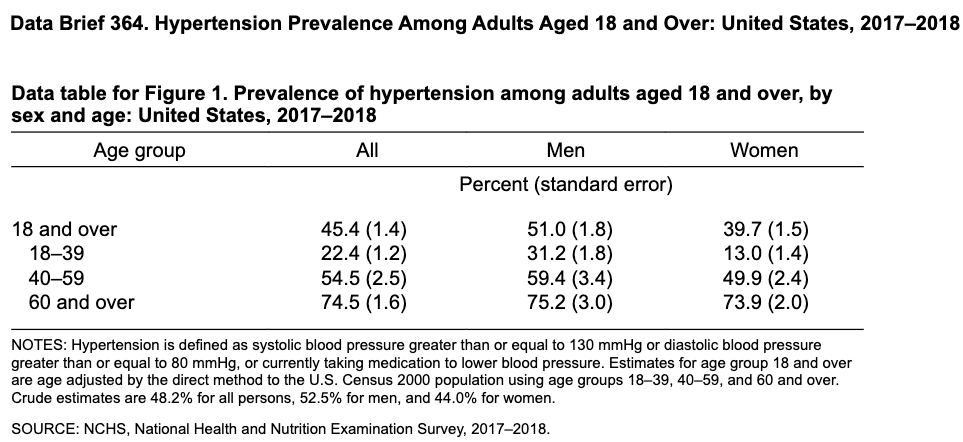

```{r}
#| label: setup
#| include: false
library(Statamarkdown)
stataexe <- "/Applications/StataNow/StataSE.app/Contents/MacOS/stata-se"
knitr::opts_chunk$set(engine.path=list(stata=stataexe))
```

## Source 

This is a subset of NHANES data from 2015-16 and 2017-19 cohorts created for use in the NCSP methods class.  After that time NHANES missed one cohort during Covid and then substantially changed when in resumed in 2021.

## Dataset


Download: [nhanes_ncsp.dta](../../data/nhanes_ncsp.dta)

or use directly in code

```stata
use https://tphofer.github.io/ncsp-hhcr/data/nhanes_ncsp.dta
```

The datset is real NHANES data of the full sample described above abstracted for a subset of variables using the R code below and a github repository that does some of the pre-processing for you.
```{r}
#| eval: false
#| code-fold: true
library(nhanesdata)
library(dplyr)
library(ggplot2)
# pak::pak("kyleGrealis/nhanesdata") installed 5/22/2026 updated 5/4/26
demo <- read_nhanes("demo")
# glimpse(demo)
demo <- read_nhanes("demo")
# get_url("DEMO_L") for documentation of variables in demo
bpx <- read_nhanes("bpx")
bmx <- read_nhanes("bmx")
bpq <- read_nhanes("bpq")

analysis_data <- demo |>
  inner_join(bpx, by = c("seqn", "year")) |>
  inner_join(bmx, by = c("seqn", "year")) |>
  inner_join(bpq, by = c("seqn", "year")) |>
  mutate(education = factor(
    case_when(
      dmdeduc2 == "Less than 9th grade" ~ "Less than high school",
      startsWith(as.character(dmdeduc2), "9-11th grade") ~ "Some high school",
      dmdeduc2 == "High school graduate/GED or equivalent" ~ "HS Graduate or GED",
      dmdeduc2 == "Some college or AA degree" ~ "Some college or AA",
      dmdeduc2 == "College graduate or above" ~ "College graduate or above"
    ),
    levels = c("Less than high school", "Some high school", "HS Graduate or GED",
               "Some college or AA", "College graduate or above")  
    )) |>
    mutate(age_grp = factor(
    case_when(
        ridageyr < 18  ~ "< 18",
        ridageyr < 40  ~ "18-39",
        ridageyr < 60  ~ "40-59",
        ridageyr >= 60 ~ "> 60"
    ),
    levels = c("< 18", "18-39", "40-59", "> 60")
    )) |>
  select(year, seqn, ridageyr, age_grp, sddsrvyr, education, dmdmartl, indfmpir, ridreth3, riagendr, bpxsy1,bpxsy2,bpxsy3,bpxsy4,bpxdi1,bpxdi2,bpxdi3,bpxdi4, bmxbmi,bpq050a, ridexprg, sdmvstra, sdmvpsu, wtmec2yr) |>
  filter(year >= 2015)
var_labels <- c(
  year     = "Survey year",
  seqn     = "Respondent sequence number",
  ridageyr = "Age in years",
  age_grp  = "Age group",
  sddsrvyr = "Data release cycle",
  education = "Education level (recoded)",
  dmdmartl = "Marital status",
  indfmpir = "Family poverty income ratio",
  ridreth3 = "Race/Hispanic origin (incl. NH Asian)",
  riagendr = "Sex",
  bpxsy1   = "Systolic BP, reading 1 (mm Hg)",
  bpxsy2   = "Systolic BP, reading 2 (mm Hg)",
  bpxsy3   = "Systolic BP, reading 3 (mm Hg)",
  bpxsy4   = "Systolic BP, reading 4 (mm Hg)",
  bpxdi1   = "Diastolic BP, reading 1 (mm Hg)",
  bpxdi2   = "Diastolic BP, reading 2 (mm Hg)",
  bpxdi3   = "Diastolic BP, reading 3 (mm Hg)",
  bpxdi4   = "Diastolic BP, reading 4 (mm Hg)",
  bmxbmi   = "Body mass index (kg/m^2)",
  bpq050a  = "Now taking prescribed medicine for HBP",
  ridexprg = "Pregnancy status at exam",
  sdmvstra = "Masked variance pseudo-stratum",
  sdmvpsu  = "Masked variance pseudo-PSU",
  wtmec2yr = "MEC 2-year exam weight"
)

for (v in names(var_labels)) {
  attr(analysis_data[[v]], "label") <- var_labels[[v]]
}
haven::write_dta(analysis_data, "data/nhanes_ncsp.dta")
```

```{stata, include="false"}
use "../../data/nhanes_ncsp.dta",clear
compress
save,replace
```

__Example__

Reproduce a [table of hypertension prevalence](https://www.cdc.gov/nchs/data/databriefs/db364-tables-508.pdf#page=1)
from [Report - NCHS Data Brief No. 364, April 2020 ](https://www.cdc.gov/nchs/products/databriefs/db364.htm)



Full [SAS code](https://wwwn.cdc.gov/nchs/data/Tutorials/Code/DB364_SAS.sas) is available for all of the tables and figures in the report.

Below I reproduced age category by gender prevalence estimates using the nhanes-ncsp dataset and the stata code folded below
```{stata, results="hide"}
use "../../data/nhanes_ncsp.dta",clear
* Table excludes preganant women
encode ridexprg , gen(pregnant) label(preg)
encode riagendr , gen(gender) label(gender)
* If (diastolic) BP value is 0 then change to missing
foreach var of var bpxdi*	{
	replace `var'=. if `var'==0
}
egen sys_mean=rowmean(bpxsy*)
egen dia_mean=rowmean(bpxdi*)

* Define hyperternsive variable using new AHA/ACC guidelines 130/80
gen new_htn=. 
* elevated diastolic or systolic is counted as hypertensive or reporting on BP med
replace new_htn=1 if sys_mean>=130&sys_mean<. | dia_mean>=80&dia_mean<. | bpq050a=="Yes"
* Include as non-hypertensive those with non-missing and non-high BPs
egen sys_no_miss=rownonmiss(bpxsy*)
egen dia_no_miss=rownonmiss(bpxdi*)
replace new_htn=0 if (sys_no_mis>0 & dia_no_mis>0) & new_htn==.

* Define subpop  non-pregant persons >18, with one or more 
*      non-missing BPs in 2017-2019 cohort
gen include=(ridageyr>=18 & !missing(ridageyr)) & pregnant!=3 & ///
    (sys_no_miss!=0 | dia_no_miss!=0) & year==2017

* Calculate HTN prevalence
replace new_htn=100 if new_htn==1   // prevalence as %
svyset [w=wtmec2yr], psu(sdmvpsu) strata(sdmvstra) vce(linearized)
collect: svy: mean new_htn, over(age_grp gender) subpop(include)

* Produce Table
collect layout (age_grp) (gender#result[_r_b _r_se])
collect style header result, level(label) title(hide)
collect label levels result _r_b "%" _r_se "SE", modify
collect style cell result[_r_b],  nformat(%5.1f)
collect style cell result[_r_se], nformat(%5.1f) sformat("(%s)")
collect title "Hypertension prevalence (%), adults 18+, NHANES"
collect style autolevels gender 2 1
collect style header gender, title(hide) level(label)
collect preview
collect export htn_table.html, replace
```


```{=html}

```

## Dataset description

continuous, repeated measures, demographics

### Features


### Variables

You can look up variables on the [NCHS website variable lookup tool](https://wwwn.cdc.gov/nchs/nhanes/search/default.aspx)

```stata
. codebook, compact

Variable     Obs Unique      Mean       Min       Max  Label
----------------------------------------------------------------------------------------------
year       11891      2   2015.98      2015      2017  Survey year
seqn       11891  11891  93393.81     83732    102956  Respondent sequence number
ridageyr   11891     65  47.21882        16        80  Age in years
age_grp    11891      4   2.88218         1         4  Age group
sddsrvyr   11891      2         .         .         .  Data release cycle
education  10724      5  3.476035         1         5  Education level (recoded)
dmdmartl   10739      7         .         .         .  Marital status
indfmpir   10495    487  2.446261         0         5  Family poverty income ratio
ridreth3   11891      6         .         .         .  Race/Hispanic origin (incl. NH Asian)
riagendr   11891      2         .         .         .  Sex
bpxsy1     10876     74  124.7269        72       236  Systolic BP, reading 1 (mm Hg)
bpxsy2     11255     75  124.7012        72       238  Systolic BP, reading 2 (mm Hg)
bpxsy3     11214     78  124.2804        72       238  Systolic BP, reading 3 (mm Hg)
bpxsy4       737     62  134.1493        76       234  Systolic BP, reading 4 (mm Hg)
bpxdi1     10876     56  70.07448         0       136  Diastolic BP, reading 1 (mm Hg)
bpxdi2     11255     58  70.24789         0       144  Diastolic BP, reading 2 (mm Hg)
bpxdi3     11214     60  70.18709         0       140  Diastolic BP, reading 3 (mm Hg)
bpxdi4       737     45  75.63094         0       132  Diastolic BP, reading 4 (mm Hg)
bmxbmi     11713    449  29.31031      13.2      86.2  Body mass index (kg/m^2)
bpq050a     3620      2         .         .         .  Now taking prescribed medicine for HBP
ridexprg    2297      3         .         .         .  Pregnancy status at exam
sdmvstra   11891     30  133.4681       119       148  Masked variance pseudo-stratum
sdmvpsu    11891      2  1.501219         1         2  Masked variance pseudo-PSU
wtmec2yr   11891  10512  42517.69  4579.581  419762.8  MEC 2-year exam weight
------------------------------------------------------------------------------------------------
```


### To obtain data directly yourself

Main [CDC NHANES site documentation and download site](https://www.ddshub.nih.gov/data-sources/nhanes-national-health-nutrition-examination-survey)


[Examples of reproducing NHANES CDC tables](https://wwwn.cdc.gov/nchs/nhanes/tutorials/SampleCode.aspx) in several languages including Stata, R, SAS and Sudaan

* [Depression prevalence 2013-2016-Stata do-file](https://wwwn.cdc.gov/nchs/data/Tutorials/Code/DB303_STATA16.do)
<!-- can use in measurement sum dpq010-dpq100 if !missing(Depression_Indicator) -->

Note: Stata has a [NHANES format MI impport command](https://www.stata.com/manuals/mimiimportnhanes1.pdf) for some of the MI file versions NHANES has presumably.


<!-- extra code works well
********NHANES direct from CDC

https://blog.uvm.edu/tbplante/2021/11/15/using-statas-frames-feature-to-build-an-analytical-dataset/

clear
frames reset
global url "https://wwwn.cdc.gov/Nchs/Data/Nhanes/Public/"
global F "2009/DataFiles/"
global G "2011/DataFiles/"  
* then change to foreach x in F G below
global files DEMO BPQ KIQ_U

foreach x in F G {
	foreach y in $files {
		mkf `y'_`x'
		frame `y'_`x': import sasxport5 "${url}${`x'}`y'_`x'.xpt"
	}
frame DEMO_`x': frame put seqn, into(analytical_`x')
cwf analytical_`x'
	foreach y in $files {
		frlink 1:1 seqn, frame(`y'_`x') 
	}
	frget wtint2yr wtmec2yr sdmvpsu sdmvstra, from(DEMO_`x')
	frget bpq020, from(BPQ_`x')
	frget kiq022, from(KIQ_U_`x')
}
frames dir 
pwf 
fframeappend,using(analytical_F)
de


One year
clear
frames reset
global dir "https://wwwn.cdc.gov/Nchs/Data/Nhanes/Public/2009/DataFiles/"
global files DEMO_F BPQ_F KIQ_U_F

foreach y in $files {
	mkf `y'
	frame `y': import sasxport5 "${dir}`y'.xpt"
}
frame DEMO_F: frame put seqn, into(analytical)
cwf analytical
foreach y in $files {
	frlink 1:1 seqn, frame(`y') 
}
frget wtint2yr wtmec2yr sdmvpsu sdmvstra, from(DEMO_F)
frget bpq020, from(BPQ_F)
frget kiq022, from(KIQ_U_F)
frames dir 
pwf 
-->